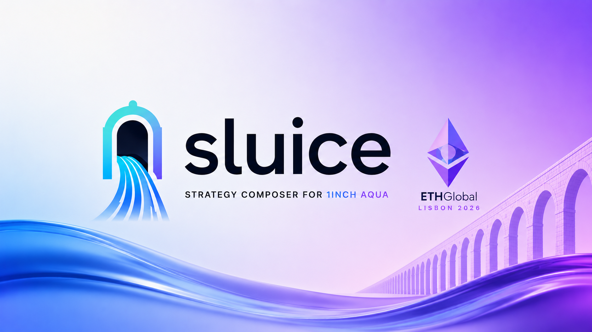

<p align="center">
  
</p>

# 🚰 sluice

**A strategy composer for 1inch Aqua.** ETHGlobal Lisbon 2026.

> Describe what you want in a sentence, commit a budget of tokens you already hold, and
> Sluice returns concrete, risk-rated Aqua market-making strategies you review and ship in a
> single signature.

## The problem

1inch Aqua's SwapVM lets you ship programmable market-making strategies — but a strategy is
low-level bytecode (`[opcode][argsLength][args]`) that almost nobody can author safely. Worse,
once a strategy is shipped it is **immutable**: the only exit is `dock()` or a deadline unwind.
There is no patching a bad strategy after the fact. That combination — hard to write, impossible
to fix — keeps Aqua out of reach for everyone who isn't fluent in its VM.

Sluice closes that gap at creation time. It is **not** a trading bot: it acts once, when you set
a position up, and never touches your positions again.

## How you use it

1. **Connect your wallet** and describe your objective in plain language — *"earn fees on
   ETH/USDC"*, *"concentrate my ETH/USDC liquidity around the current price."*
2. **Pick a budget** from tokens you already hold.
3. Sluice returns **one or more concrete strategies**, each risk-rated and explained in plain
   language.
4. **Review and sign once.** A single `Multicall` ships every strategy you approved.

Your capital never leaves your wallet — **you are the maker**. It is only ever drawn against when
a taker trades on the exact terms you set, and every strategy ships with an expiry that unwinds it
unattended.

## Why you can trust it

- **The model never writes executable code.** It only fills an ordered slot assignment from a
  fixed menu of four fork-tested templates — a constant-product curve, an optional concentration
  band, an optional fee, and a deadline. A separate deterministic compiler owns the actual
  bytecode and its instruction order (which is security-critical in SwapVM).
- **Every recommendation is composed privately and comes back signed.** Composition runs inside
  a TEE enclave, so no one can see a position before it ships and trade ahead of it, and
  recovering the signer proves a genuine enclave produced it.
- **Deterministic checks have the final say.** A validator checks each recommendation against
  your budget and the safety rules; if it doesn't comply, Sluice re-composes rather than quietly
  editing the model's output to force a pass. Refusals stay on the record.

## How it's built

Three integrations, each load-bearing — remove any one and the project stops making sense.

- **1inch Aqua + SwapVM** — the venue and the strategy language. We build against the **real,
  already-deployed Aqua** on a pinned Base mainnet fork, self-deploying only our own contracts.
  The LLM fills a settled template grammar; a deterministic compiler turns the approved assignment
  into real SwapVM bytecode. A composed strategy has already **shipped and filled** on the fork
  with real bytecode and real tokens.
- **0G** — private, signed recommendations. Each composition runs inside an Intel TDX enclave and
  returns a structured, risk-rated recommendation signed by the enclave.
- **The Graph** — market & book context. No generic Aqua subgraph existed, so we wrote and
  **deployed the first one**, live on Ethereum mainnet and Base. It reconstructs makers'
  strategies, balances, and fills from raw events and feeds your own book to the composer as
  context, alongside composed external market data.

**One hacky detail worth calling out:** a Base fork reports the same chainId *and* the same
contract bytecode as mainnet, so a wrong-network mistake looks perfectly correct. Our signing
guard probes for the fork with `anvil_nodeInfo` (not `eth_getCode`, which can't tell them apart)
and requires an explicit `SLUICE_ALLOW_MAINNET` opt-in before any transaction can touch real Base.

## Project layout

Monorepo (npm workspaces):

| Path | What's there |
| --- | --- |
| `packages/arbitration-sdk` | The composer: sealed 0G inference, the deterministic validator wired into a reject-and-re-infer loop, the SwapVM compiler with fork-proven fixtures, the subgraph book reader, and the `infer`/`compose`/`subgraph`/`fund` CLIs. |
| `packages/app` | Next.js compose screen + `POST /api/compose` (the 0G key stays server-side). Wallet connect via Reown AppKit. |
| `contracts/` | Foundry only: `SluiceStrategy.sol`, ship/take scripts, and three fork test suites against the deployed Aqua/SwapVM. |
| `subgraph/` | The Graph — the first generic Aqua subgraph, deployed to Ethereum mainnet and Base, plus a local fork stack. |
| `config/` | Pinned addresses (`addresses.8453.json`) and the pinned opcode table (`opcodes.8453.json`). |

## Running it

One command brings up the whole thing — a Base fork at the pinned block, a graph-node indexing
it, a wallet funded with 100 ETH / 10 WETH / 1000 USDC / 1 cbBTC and pre-approved to Aqua, and
the app at [localhost:3000](http://localhost:3000) with that wallet already connected:

```sh
scripts/demo-up.sh          # needs foundry, docker compose v2, node, jq
scripts/demo-down.sh        # stops all three: app, fork, index
```

Ctrl-C stops only the app and leaves the fork and the index up, so what you shipped survives a
restart of the UI. `demo-down.sh` stops the lot, from any shell.

Composition needs `ZG_PRIVATE_KEY` in `packages/app/.envrc` and a funded 0G ledger — without
either it still answers, labelled `TEMPLATE_FALLBACK`. To make a shipped strategy actually fill,
drive a taker over it:

```sh
node scripts/fork-take.mjs --maker <address> --in USDC --amount 200
```

Or run the pieces directly:

```sh
npm install

# Compose a strategy from intent + budget (SDK CLI, hits a live 0G enclave)
npm run compose --workspace @sluice/arbitration-sdk

# Run the app (compose screen + /api/compose)
npm run dev
```

Other SDK CLIs: `npm run infer` (one-shot signed inference), `npm run subgraph` (read a maker's
book), `npm run fund` (0G ledger). See each package's own README for details and required
environment.

## Status

Hackathon build, pre-alpha. Nothing here is audited — **don't point it at real funds.**
